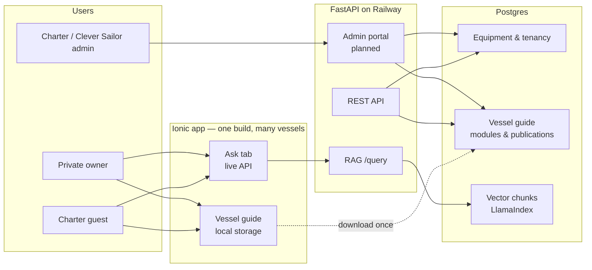

# Cattitude / Clever Sailor

Monorepo for **Clever Sailor** — a multi-vessel platform that gives charter guests, private owners, and crew a structured **vessel guide** on board (systems, checklists, troubleshooting, emergency info) plus an **Ask** tab grounded in ingested equipment manuals via RAG.

This repository is the first production deployment: **Cattitude**, a Fountaine Pajot Tanna 47 operated by Cruise Abaco in the Abacos. The codebase is intentionally structured as a single-vessel instance of a multi-tenant platform still under construction.

| Environment | URL |
|-------------|-----|
| **Live app (PWA)** | https://ilopata1.github.io/cattitude/ |
| **Production API** | https://cattitude-production.up.railway.app |
| **API health** | https://cattitude-production.up.railway.app/health |

---

## High-level summary

Clever Sailor answers one question for people on a boat: *“What do I need to know, do, and fix right now?”*

The product splits into two largely independent content systems:

1. **Vessel guide** — Authored, structured content for Home, Do, Know, and Fix. Designed to work **fully offline** after a one-time download per vessel. Stored today as bootstrap JSON in the mobile app (transitional) and in Postgres as versioned modules and publications (target source of truth).

2. **Manual library + Ask** — PDF manuals ingested into Postgres/pgvector; the Ask tab sends questions to a FastAPI backend that retrieves relevant chunks and synthesizes answers with Azure OpenAI. Requires network access when querying (cached answers on device are acceptable later).

A third layer — **equipment registry and tenancy** — models what is on each vessel, which charter company and operating base it belongs to, and who may access what. This supports onboarding, fleet management, and filtered RAG retrieval as the platform matures.

A fourth layer — **owner communities** (planned **Phase 7**) — will let users discuss specific hull models and equipment (similar to Facebook owner groups), with optional **RAG over community posts** including curated historical Facebook group content. See [`PLATFORM_ROADMAP.md`](PLATFORM_ROADMAP.md) and [`cursor-build-community-phase.md`](cursor-build-community-phase.md).



---

## User perspectives

The same mobile app serves different roles. Terminology matters: **vessel guide** content is for everyone on the boat (guests, owners, crew). **Charter guest** refers only to access control (e.g. Ask API after charter end), not to who reads the guide.

### Charter guest

Someone on a time-limited charter (e.g. weekly Abacos charter on Cattitude).

- **Before / at charter start:** Associates with a vessel (future: guest token or QR). Downloads the vessel guide bundle once (manifest + JSON + images) to local storage.
- **During charter:** Uses Home (rules, MAYDAY), Do (checklists, learn-the-boat progress), Know (systems by topic or location), Fix (quick troubleshooting cards). Uses Ask for manual-backed questions when online.
- **After charter:** Keeps the downloaded guide locally (useful for word-of-mouth). **Ask** live queries are disabled server-side when the charter ends; locally cached Ask responses remain acceptable.
- **Does not:** Edit content, access admin tools, or receive a separate app build.

### Private boat owner

Owns or operates a vessel outside a charter fleet (or as a long-term owner in the same app).

- Same app experience as a guest for guide tabs.
- Onboarding (planned): intake flow identifies equipment; LLM generates ~100% of the vessel guide from templates + intake data; owner reviews and edits in admin or a simplified editor.
- No charter company unless they choose a management company; `charter_operating_base_id` may be null — location context comes from intake or platform region packs.
- Ask remains available according to subscription / auth rules (not fully implemented).

### Charter company operator (e.g. Cruise Abaco)

B2B customer operating multiple vessels across **operating bases** (geographic locations).

- Maintains **company-wide** prompt templates (safety policy tone, checklist structure).
- Maintains **operating base** context: VHF channels, emergency contacts, marina names, local rules (Abacos vs Croatia). New bases can clone context from an existing base.
- **Onboards vessels via Admin** (create/clone vessel, equipment from registry, generate, review, publish) — not via the mobile intake wizard. See `clever-sailor-data-model.md` § Onboarding channels.
- Reviews LLM-generated guide drafts per vessel (diff + approve workflow). Publishes immutable guide snapshots for download.
- Manages fleet: which vessels belong to which base, charter dates, guest tokens.
- Uses the **admin portal** (planned, FastAPI + Jinja2) — not the Ionic app.

### Clever Sailor platform team

Internal operators building the equipment registry, manual library, and onboarding tooling.

- Curates **equipment taxonomy** (manufacturer, model, system category, zone).
- Ingests and legally clears **manuals** (`manual_work` → `manual_edition` → `manual_file`).
- Runs **vessel intake review** when photo/OCR/Signal-K identification is ambiguous.
- Owns **platform-level** prompt templates and default content for vessel types.
- Monitors **query logs** for gaps in manual coverage.

---

## Architecture

### Design principles

| Principle | Implication |
|-----------|-------------|
| **One app, many vessels** | No per-vessel app store builds. Users download a guide bundle when they associate with a vessel. |
| **Guide offline always** | Home / Do / Know / Fix never call a live content API during normal use — even when online. |
| **Ask online when allowed** | RAG `/query` requires network; auth scopes access by owner vs active charter. |
| **Postgres as source of truth** | Equipment, manuals, guide modules, publications, and operating bases live in the database. |
| **LLM at onboarding** | Most guide content is generated once, then human-reviewed — not hand-written from scratch. |
| **Publications are immutable** | Published guide = assembled bootstrap JSON + asset manifest; apps sync by content hash. |

### Repository layout

```
Cattitude/
├── mobile/                 # Ionic 8 + Angular 20 consumer app (production PWA)
├── backend/                # FastAPI, RAG, Alembic migrations, future admin
├── utilities/              # Content validation, ingest helpers, GitHub Pages patch
├── manuals/                # Raw PDFs (gitignored)
├── data/                   # Local cache (gitignored)
├── app/                    # Archived legacy single-file PWA (reference only)
├── clever-sailor-data-model.md   # Canonical Postgres + vessel guide schema
├── cursor-build-admin-portal.md  # Planned admin UI spec
├── cursor-build-intake-flow.md   # Planned vessel onboarding spec
└── cattitude-rag-implementation-plan.md  # Original RAG staging plan
```

### Mobile app (`mobile/`)

**Stack:** Ionic 8, Angular 20, Capacitor config stub, Angular service worker (production PWA).

**Tabs:**

| Tab | Purpose | Data source |
|-----|---------|-------------|
| **Home** | Branding, MAYDAY, rules, emergency contacts | Vessel guide (local) |
| **Do** | Checklists, learn-the-boat progress | Vessel guide (local) |
| **Know** | Systems by topic or boat location | Vessel guide (local) |
| **Fix** | Quick troubleshooting cards by category | Vessel guide (local) |
| **Ask** | Manual Q&A with source citations | Railway `/query` (network) |

**Key paths:**

```
mobile/src/
  app/
    core/
      models/           # BootstrapContent, Postgres enum mirrors
      services/         # ContentService, ChatService, ProgressService, VesselContextService
      initializers/     # Loads bootstrap JSON at startup (transitional)
    pages/              # home, do, know, fix, ask
    shared/             # Header, emergency modal, photo lightbox, rich HTML
    tabs/               # Tab shell + routing
  data/bootstrap/       # cattitude.json — vessel guide payload (transitional in-repo)
  assets/images/systems/
  environments/         # apiUrl, vesselSlug, bootstrapContentPath
```

**Transitional vs target loading:**

- **Today (production):** `ContentService` loads bundled `data/bootstrap/cattitude.json` (`guideSyncEnabled: false`). Legacy `/tabs/…` URLs redirect to `/v/cattitude/tabs/…`.
- **Development:** `guideSyncEnabled: true` — sync from `GET /api/v1/vessels/{slug}/guide/*` into IndexedDB, with bundled JSON / cache fallback.
- **Target:** Same sync path in production; admin publish updates content without a mobile redeploy.

**Offline / PWA:** Production builds register `@angular/service-worker`. Installed home-screen apps may lag behind browser tabs until the service worker updates; see `mobile/README.md`.

**Deploy:** Push to `main` with changes under `mobile/` triggers `.github/workflows/sync-mobile-pages-live.yml`, which builds `mobile/www` and pushes to the `pages-live` branch. `baseHref` is `/cattitude/`; `utilities/patch_github_pages_assets.mjs` rewrites asset URLs for GitHub Pages.

### Backend (`backend/`)

**Stack:** FastAPI, LlamaIndex, Azure OpenAI (chat + embeddings), Postgres + pgvector, Alembic migrations, Docker on Railway.

**Current API:**

| Method | Path | Purpose |
|--------|------|---------|
| `GET` | `/health` | Health check (Railway) |
| `POST` | `/query` | RAG question → answer + source snippets |
| `GET` | `/api/v1/vessels/{slug}/guide/manifest` | Publication version, bundle URL, asset list |
| `GET` | `/api/v1/vessels/{slug}/guide/bundle.json` | Assembled bootstrap JSON |
| `GET` | `/api/v1/vessels/{slug}/guide/assets/{path}` | Guide images |
| `GET` | `/api/v1/vessels/{slug}/guide/version` | Lightweight content-hash check |

Auth for guide download is not enforced yet (planned: charter guest / owner tokens). The mobile app still loads bundled `cattitude.json` by default; set `guideSyncEnabled: true` in environment to sync from the API into IndexedDB.

**Planned API (see `clever-sailor-data-model.md`):**

| Method | Path | Purpose |
|--------|------|---------|
| Admin + generation endpoints | — | Prompt templates, module review, publish gates |

**RAG pipeline:**

1. Manuals ingested via `backend/ingest.py` (Docling → chunks → Azure embeddings → pgvector).
2. `query.py` builds a LlamaIndex retriever over the vector store; `main.py` exposes `/query`.
3. Chunk metadata should include `manual_edition_id` (not just `manual_work_id`) so edition supersession works.
4. LlamaIndex creates the vector table (`manual_chunks` / `data_*`) automatically — not in Alembic migrations.

**Configuration:** `backend/config.py` reads `DATABASE_URL`, Azure OpenAI settings, and `CORS_ORIGINS` from `.env` (repo root or `backend/.env`). Production must include `https://ilopata1.github.io` for the Ask tab.

### Data model (Postgres)

Full DDL, enums, and acceptance criteria: **`clever-sailor-data-model.md`**.

Three conceptual layers in one database:

**1. Equipment registry & manual library**

- `equipment`, `option_pack`, `equipment_constraint`, `manufacturer_config_availability`
- `manual_work`, `manual_edition`, `manual_file` (dedupe by `file_hash`; one current edition per work)
- `vessel_equipment` links vessels to registry rows
- Vectors in LlamaIndex-managed tables

**2. Tenancy & operations**

- `charter_companies` → `charter_operating_bases` → `vessels`
- `charter_operating_bases.guide_context` — JSON: VHF, contacts, marina, local rules (injected at LLM generation)
- `charters` (dates, `guest_token`)
- `query_log`, `notifications`

**3. Vessel guide**

- `guide_prompt_template` — versioned LLM prompts (scopes: platform, charter_company, charter_operating_base, vessel_type)
- `guide_generation_input_snapshot`, `guide_generation_run` — audit trail for onboarding/regen
- `guide_content` — JSONB modules (systems, checklists, fixes, ui, …) with draft → approved → published workflow
- `vessel_guide_publication` — immutable assembled bootstrap + asset manifest for client download

**Prompt resolution order:** platform → charter company → operating base (optional override) → vessel type → inject operating base `guide_context` into snapshot → vessel intake.

**Locked product rules (vessel guide):**

- Regenerate creates a **draft + diff**; never silently overwrites published content.
- Fleet prompt updates are **manual** (stale-template badge in admin).
- Checklist body and UI chrome (Do menu, checklistMeta) generated in the **same LLM job**.
- Charter guests **keep** downloaded guide after charter; Ask API denied when charter expired.

**Migrations:** Alembic revisions `001`–`011` in `backend/alembic/versions/`. Apply with `python -m alembic upgrade head` from `backend/`.

---

## Vessel guide content workflow

### Current (Cattitude production)

**Postgres** holds Cattitude’s `guide_content` modules and `vessel_guide_publication` (migrated once from legacy JSON). **Admin** is the path for review and republication.

**Mobile PWA** still ships a frozen copy of `cattitude.json` + images from the `mobile/` build (`guideSyncEnabled: false`). Do not edit the JSON for content changes — wait for admin/generation tooling.

### Target (multi-vessel platform)

1. **Intake** captures vessel + equipment (+ photos, Signal-K) → frozen input snapshot.
2. **LLM generation** runs prompt stack (company + operating base context + vessel type) → `guide_content` drafts.
3. **Admin review** — diff, accept, approve modules.
4. **Publish** — assembler validates and writes `vessel_guide_publication`.
5. **Client sync** — app downloads manifest once; uses local copy until hash changes.

`utilities/extract_bootstrap_content.mjs` is **legacy only** (one-time migration from archived `app/index.html`).

---

## Local development

### Prerequisites

- Node.js 20.19+ (mobile)
- Python 3.12+ (backend; see `backend/.python-version`)
- Postgres 15+ with `pgvector` (Docker: `ankane/pgvector`)
- Azure OpenAI resource (embeddings + chat deployments)

### Mobile

```bash
cd mobile
npm install
npm start
```

Open http://localhost:8100. Ask tab needs the backend running locally or point `environment.ts` at Railway.

Production-like PWA test:

```bash
npm run build
npx serve www -p 8100
```

### Backend

```bash
cd backend
python -m venv .venv
# Windows: .venv\Scripts\activate
# macOS/Linux: source .venv/bin/activate
pip install -r requirements.txt
cp .env.example .env
# Edit .env: DATABASE_URL, AZURE_OPENAI_*, CORS_ORIGINS
python -m alembic upgrade head
python scripts/seed_dev_data.py
uvicorn main:app --reload --port 8000
```

**Admin portal:** set `ADMIN_PASSWORD` in `.env`, then open http://localhost:8000/admin/ (HTTP Basic Auth). Screens: operating base `guide_context` editor, vessel guide modules, publish gate, prompt template list.

**Note:** `seed_dev_data.py` does not populate guide modules. Use a DB dump from an environment where Cattitude was migrated, or add modules via future admin/generation tooling.

### Manual ingest

From `backend/`:

```bash
python ingest.py --file ../manuals/your_manual.pdf --manual-id your_manual_id --tags engine brand
```

Bulk ingest helper: `utilities/ingest_all_manuals.py`. Clear vectors: `utilities/clear_vector_store.py`.

### Environment variables (backend)

| Variable | Purpose |
|----------|---------|
| `DATABASE_URL` | Postgres connection string |
| `AZURE_OPENAI_API_KEY` | Azure OpenAI |
| `AZURE_OPENAI_ENDPOINT` | Azure endpoint URL |
| `AZURE_OPENAI_EMBEDDING_DEPLOYMENT` | e.g. `text-embedding-3-small` |
| `AZURE_OPENAI_CHAT_DEPLOYMENT` | e.g. `gpt-4o` |
| `CORS_ORIGINS` | Comma-separated browser origins |
| `ADMIN_USERNAME` | Admin portal Basic Auth username (default `admin`) |
| `ADMIN_PASSWORD` | Admin portal password (required to use `/admin`; empty disables login) |

---

## Deployment

| Component | Host | Trigger |
|-----------|------|---------|
| **Mobile PWA** | GitHub Pages (`pages-live` branch) | Push to `main` changing `mobile/**` |
| **API + Postgres** | Railway | Push to `main` / Railway auto-deploy (`backend/railway.toml`) |

Railway Postgres: run migrations after deploy if needed:

```bash
cd backend && python -m alembic upgrade head
```

Seed is for initial tenancy/equipment setup — not every deploy.

---

## Documentation index

| Document | Audience | Contents |
|----------|----------|----------|
| **`clever-sailor-data-model.md`** | Backend / DB developers | Full Postgres schema, vessel guide publication contract, Alembic order, acceptance criteria |
| **`mobile/README.md`** | Frontend developers | Ionic dev commands, PWA notes, bootstrap editing |
| **`cattitude-rag-implementation-plan.md`** | Historical / staging | Original RAG MVP plan (Stages 1–4) |
| **`cursor-build-admin-portal.md`** | Planned work | Internal admin screens (equipment, manuals, guide review, publish) |
| **`cursor-build-intake-flow.md`** | Planned work | Private-owner mobile intake (five steps); charter guests do not use this |
| **`clever-sailor-schema-reference.docx`** | Schema authority | Field-level reference for core platform tables |
| **`app/README.md`** | Reference | Archived legacy PWA |

---

## Roadmap: built vs planned

| Area | Status |
|------|--------|
| Ionic app (5 tabs, PWA, GitHub Pages) | **Shipped** (Cattitude) |
| Bootstrap JSON content workflow + validation | **Shipped** |
| FastAPI `/query` RAG + Railway deploy | **Shipped** |
| Postgres schema migrations 001–011 | **Shipped** |
| Operating bases + `guide_context` | **Shipped** (schema + seed) |
| Cattitude guide in Postgres (`guide_content` + publication) | **Shipped** (one-time migration complete) |
| Guide sync API + mobile local store | **Shipped** (API + IndexedDB sync; `guideSyncEnabled` off by default) |
| Admin portal — operating base + publish + vessels | **Shipped** (vessel CRUD, clone, equipment picker) |
| Admin portal — equipment registry, manuals, option packs | **Shipped** |
| LLM generation pipeline + admin review gates | **In progress** (full per-vessel LLM; no freemium tier yet) |
| Guide generation economics (freemium / template assembly) | **Planned** — [`PLATFORM_ROADMAP.md`](PLATFORM_ROADMAP.md) § Guide generation economics |
| LLM fragment cache (Postgres-first; Redis for Ask optional) | **Planned** — same workstream |
| Admin portal (intake review, query logs, notifications) | **Planned** |
| Vessel intake flow (Ionic) | **Planned** |
| Multi-vessel app shell (add vessel, switch vessel) | **Planned** |
| Auth0 / guest tokens / charter-scoped Ask | **Planned** (Phase 4) |
| Owner communities + community RAG | **Planned** (Phase 7) |
| Capacitor native builds | **Deferred** |
| Filtered RAG by `vessel_equipment` | **Planned** (Stage 3) |

**Full phase list:** [`PLATFORM_ROADMAP.md`](PLATFORM_ROADMAP.md)

---

## Handoff notes for new developers

1. **Read `clever-sailor-data-model.md` first** if you touch the database, guide generation, or API contracts. The mobile bootstrap JSON shape is the published output contract — TypeScript types in `mobile/src/app/core/models/bootstrap-content.model.ts` must stay aligned.

2. **Distinguish vessel guide from Ask.** Changing `cattitude.json` does not affect RAG. Changing manuals or ingest affects Ask only. Operating base `guide_context` affects future generation, not the live app until republication and client sync.

3. **Cattitude is a transitional deployment.** Single `vesselSlug` in environment, bootstrap file in git, GitHub Pages path prefix `/cattitude/`. Platform work should generalize without breaking this URL.

4. **Alembic is the only schema change path.** Do not hand-edit production tables. Vector tables are managed by LlamaIndex ingest.

5. **CI validates bootstrap JSON** before mobile deploy. Broken JSON blocks Pages sync.

6. **CORS and error handling:** Backend returns JSON errors with CORS headers on `/query` failures — otherwise the browser reports a misleading CORS error on 500 responses.

7. **Planned admin and intake** are spec-only in `cursor-build-*.md` where marked planned — see [`PLATFORM_ROADMAP.md`](PLATFORM_ROADMAP.md) for phase ordering. Phase 7 (owner communities + community RAG) is documented in `cursor-build-community-phase.md`.

For questions about original product intent and staging, see `cattitude-rag-implementation-plan.md` and `PLATFORM_ROADMAP.md`. For schema field disputes, `clever-sailor-schema-reference.docx` wins over markdown docs.
