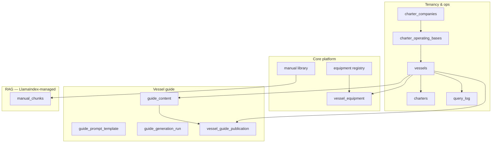
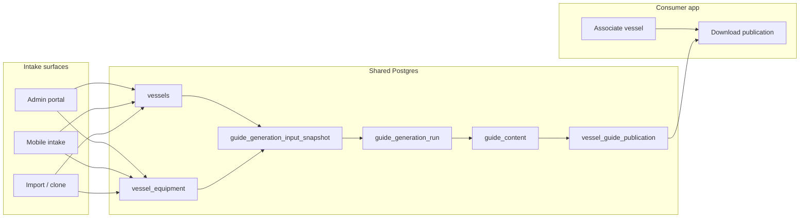

# Clever Sailor — Postgres Data Model

## Objective

Single reference for the Clever Sailor Postgres schema: equipment registry, manual library (RAG), tenancy, operational tables, and **vessel guide** content (generation, publication, download).

This document is **schema and migration work** plus contracts for publication/sync APIs. Application logic and Admin UI screens are specified in companion build docs.

## Source of truth

Read before writing SQL:

1. **`clever-sailor-schema-reference.docx`** — authoritative field-by-field schema for core platform tables.
2. **Project briefing, Section 4.5** — `manual_chunks` and LlamaIndex `PGVectorStore`.
3. **This document** — vessel guide extension, publication contract, and locked product decisions.

If anything here conflicts with the schema reference document, **the schema reference wins**. Flag conflicts rather than silently picking one.

---

## Terminology

| Term | Meaning |
|------|---------|
| **Manual library** | PDF manuals (`manual_work` / `manual_edition` / `manual_file`) and vector chunks for the **Ask** tab. |
| **Vessel guide** | All other in-app content (Home, Do, Know, Fix): systems, checklists, fixes, locations, branding, emergency, UI shell. |
| **Publication** | Immutable assembled bootstrap snapshot + asset manifest, downloadable to the mobile app. |
| **Charter guest** | User scoped by `charters.guest_token`. Distinct from vessel guide audience (owners, crew, guests all use the same local guide). |
| **Charter operator** | Staff of a charter company (fleet manager, base manager). Onboards vessels via **Admin**; does not use the consumer app for fleet setup. |
| **Operating base** | A charter company's geographic base (e.g. Abacos, Split). Supplies **guide context** (VHF, contacts, marina, local rules) and optional prompt overrides. |

---

## Conceptual model

Three layers in one database:



**Mobile runtime:**

- **Vessel guide** — read only from **local storage** (downloaded once per vessel association; updated when publication hash changes). Never fetched per tab at runtime.
- **Ask** — live `/query` when authorized; locally cached answers acceptable; no live queries after charter end.

---

## Environment

- **Target:** PostgreSQL 15+ (`pgvector`, `gen_random_uuid()`)
- **Local dev:** Docker `ankane/pgvector`
- **Production:** Railway Postgres
- **Migrations:** Alembic (Python/SQLAlchemy), unless an existing tool is already in `backend/`

---

## Required extensions

```sql
CREATE EXTENSION IF NOT EXISTS vector;
CREATE EXTENSION IF NOT EXISTS pgcrypto;
```

---

## Build order

Apply migrations in dependency order:

| Step | Objects |
|------|---------|
| 1 | Core enums (see below) |
| 2 | `equipment`, `hull_model`, `option_pack`, `option_pack_equipment`, `option_pack_child_pack`, `option_pack_hull_model`, `manufacturer_config_availability`, `equipment_constraint` |
| 3 | `manual_work`, `manual_edition`, `manual_file` |
| 4 | `charter_companies`, `vessels`, `vessel_equipment`, `charters` |
| 5 | `query_log`, `notifications` |
| 6 | Vessel guide enums |
| 7 | `guide_prompt_template`, `guide_generation_input_snapshot`, `guide_generation_run`, `guide_content`, `vessel_guide_publication` |
| 11 | `charter_operating_bases`, `vessels.charter_operating_base_id`, `guide_scope` + `charter_operating_base` |
| 13 | `hull_model`, `option_pack_hull_model`, `vessels.hull_model_id`; drop `option_pack.applicable_models` |
| 14 | Rename `option_pack_applicable_model` → `option_pack_hull_model` (if 013 created old name) |
| 15 | `option_pack_child_pack` (nested pack membership) |
| — | `manual_chunks` — **do not hand-build** (LlamaIndex creates on first ingest) |

---

## Core platform enums

```sql
CREATE TYPE vessel_type AS ENUM (
    'sailing_catamaran', 'cruising_monohull', 'sailing_trimaran',
    'power_catamaran', 'motor_yacht', 'sport_fishing'
);

CREATE TYPE zone_cardinality AS ENUM ('fixed', 'configurable');

CREATE TYPE system_category AS ENUM (
    'propulsion', 'fuel_system', 'electrical_dc', 'electrical_ac_shore_power',
    'freshwater_system', 'sanitation', 'bilge_and_drainage', 'steering',
    'anchoring_ground_tackle', 'rigging_sail_handling', 'sails',
    'navigation_electronics', 'communications', 'refrigeration_galley',
    'hvac_climate', 'safety_equipment', 'tenders_davits', 'stabilisation',
    'entertainment_connectivity', 'hull_and_structure'
);

CREATE TYPE equipment_class AS ENUM (
    'branded_major', 'branded_minor', 'generic_hardware',
    'built_installed', 'structural_fixed', 'consumable_dated'
);

CREATE TYPE configuration_tier AS ENUM (
    'structural', 'option_pack', 'discrete_option', 'aftermarket'
);

CREATE TYPE identification_method AS ENUM (
    'nameplate', 'visual_description', 'builder_spec'
);

CREATE TYPE pack_source AS ENUM (
    'manufacturer_published', 'team_researched', 'owner_confirmed'
);

CREATE TYPE constraint_type AS ENUM (
    'excludes', 'requires', 'mutually_exclusive_group'
);

CREATE TYPE confirmed_by_method AS ENUM (
    'config_match', 'photo_intake', 'owner_reported', 'team_verified'
);

CREATE TYPE manual_type AS ENUM (
    'operators', 'service', 'installation', 'parts'
);

CREATE TYPE source_tier AS ENUM ('tier_1', 'tier_2', 'tier_3');

CREATE TYPE legal_status AS ENUM ('pending', 'cleared', 'dmca_removed');

CREATE TYPE zone AS ENUM (
    'bow_foredeck', 'helm_station', 'cockpit_aft_deck', 'saloon_main_cabin',
    'galley', 'engine_room', 'lazarette_aft_storage', 'swim_platform_transom',
    'below_decks_bilge',
    'port_hull', 'starboard_hull', 'bridgedeck_coachroof', 'trampoline_foredeck_netting',
    'mast_base_deck_step', 'keel_centreboard_trunk', 'quarter_berth_aft_cabin',
    'flybridge', 'engine_room_walkin', 'bait_tackle_station'
);
```

**Notes:**

- `equipment.vessel_types` → `vessel_type[]`
- Single `zone` enum across universal / multihull / monohull / power sub-groups

---

## Equipment registry

### `equipment`

```sql
CREATE TABLE equipment (
    id UUID PRIMARY KEY DEFAULT gen_random_uuid(),
    manufacturer TEXT,
    model TEXT,
    vessel_types vessel_type[] NOT NULL DEFAULT '{}',
    zone zone NOT NULL,
    zone_cardinality zone_cardinality NOT NULL DEFAULT 'fixed',
    system_category system_category NOT NULL,
    equipment_class equipment_class NOT NULL,
    configuration_tier configuration_tier NOT NULL,
    has_formal_manual BOOLEAN NOT NULL DEFAULT false,
    identification_method identification_method NOT NULL,
    created_at TIMESTAMPTZ NOT NULL DEFAULT now()
);

CREATE INDEX idx_equipment_manufacturer_model ON equipment (manufacturer, model);
CREATE INDEX idx_equipment_system_category ON equipment (system_category);
CREATE INDEX idx_equipment_vessel_types ON equipment USING GIN (vessel_types);
```

### `hull_model`

Builder product lines (e.g. Fountaine Pajot FP44, Jeanneau Sun Odyssey 490). Distinct from `equipment` registry items and from a specific vessel instance.

```sql
CREATE TABLE hull_model (
    id UUID PRIMARY KEY DEFAULT gen_random_uuid(),
    manufacturer TEXT NOT NULL,
    model_code TEXT NOT NULL,
    display_name TEXT,
    vessel_type vessel_type NOT NULL,
    aliases TEXT[] NOT NULL DEFAULT '{}',
    created_at TIMESTAMPTZ NOT NULL DEFAULT now(),
    UNIQUE (manufacturer, model_code)
);

CREATE INDEX idx_hull_model_manufacturer ON hull_model (manufacturer);
CREATE INDEX idx_hull_model_vessel_type ON hull_model (vessel_type);
CREATE INDEX idx_hull_model_aliases ON hull_model USING GIN (aliases);
```

- `model_code` — canonical key used in imports and configurator cross-refs (`FP44`, `Oceanis 46.1`).
- `display_name` — human label when it differs from `model_code`.
- `aliases` — alternate strings for intake matching (`SO 490`, `Sun Odyssey 490`).

CSV import: `hull_models.csv` — `manufacturer`, `model_code`, `display_name`, `vessel_type`, optional `aliases` (pipe-separated).

### `option_pack`

```sql
CREATE TABLE option_pack (
    id UUID PRIMARY KEY DEFAULT gen_random_uuid(),
    manufacturer TEXT NOT NULL,
    pack_name TEXT NOT NULL,
    source pack_source NOT NULL,
    created_at TIMESTAMPTZ NOT NULL DEFAULT now()
);
```

Pack membership (many-to-many with `equipment`) is in `option_pack_equipment`. Nested packs (parent includes child packs) are in `option_pack_child_pack`. Hull applicability (many-to-many with `hull_model`) is in `option_pack_hull_model`. Pack header rows in `equipment` (`configuration_tier = 'option_pack'`) remain searchable registry entries.

### `option_pack_child_pack`

```sql
CREATE TABLE option_pack_child_pack (
    parent_pack_id UUID NOT NULL REFERENCES option_pack(id) ON DELETE CASCADE,
    child_pack_id UUID NOT NULL REFERENCES option_pack(id) ON DELETE CASCADE,
    sort_order INT NOT NULL DEFAULT 0,
    is_optional BOOLEAN NOT NULL DEFAULT false,
    source_note TEXT,
    created_at TIMESTAMPTZ NOT NULL DEFAULT now(),
    PRIMARY KEY (parent_pack_id, child_pack_id),
    CONSTRAINT chk_option_pack_child_not_self
        CHECK (parent_pack_id <> child_pack_id)
);

CREATE INDEX idx_option_pack_child_pack_child
    ON option_pack_child_pack (child_pack_id);
```

`apply_option_pack` resolves equipment transitively: direct `option_pack_equipment` rows plus all equipment from child packs (cycle-safe). Import must not create cycles.

CSV import: `option_pack_child_pack.csv` — `parent_manufacturer`, `parent_pack_name`, `child_manufacturer`, `child_pack_name`, optional `sort_order`, `is_optional`, `source_note`. Resolved to `(parent_pack_id, child_pack_id)` at import time. If `(manufacturer, pack_name)` is ambiguous, disambiguate `pack_name` in `option_packs.csv` before linking.

### `option_pack_hull_model`

```sql
CREATE TABLE option_pack_hull_model (
    option_pack_id UUID NOT NULL REFERENCES option_pack(id) ON DELETE CASCADE,
    hull_model_id UUID NOT NULL REFERENCES hull_model(id) ON DELETE CASCADE,
    created_at TIMESTAMPTZ NOT NULL DEFAULT now(),
    PRIMARY KEY (option_pack_id, hull_model_id)
);

CREATE INDEX idx_option_pack_hull_model_hull_model
    ON option_pack_hull_model (hull_model_id);
```

CSV import: `option_pack_hull_model.csv` — `manufacturer`, `pack_name`, `hull_manufacturer`, `hull_model_code`.

### `option_pack_equipment`

```sql
CREATE TABLE option_pack_equipment (
    option_pack_id UUID NOT NULL REFERENCES option_pack(id) ON DELETE CASCADE,
    equipment_id UUID NOT NULL REFERENCES equipment(id) ON DELETE CASCADE,
    sort_order INT NOT NULL DEFAULT 0,
    quantity INT NOT NULL DEFAULT 1,
    is_optional BOOLEAN NOT NULL DEFAULT false,
    source_note TEXT,
    created_at TIMESTAMPTZ NOT NULL DEFAULT now(),
    PRIMARY KEY (option_pack_id, equipment_id)
);

CREATE INDEX idx_option_pack_equipment_equipment ON option_pack_equipment (equipment_id);
```

CSV import: `option_pack_equipment.csv` with columns `manufacturer`, `pack_name`, `equipment_manufacturer`, `equipment_model`, optional `sort_order`, `quantity`, `is_optional`, `source_note`.

### `manufacturer_config_availability`

```sql
CREATE TABLE manufacturer_config_availability (
    manufacturer TEXT PRIMARY KEY,
    has_public_configurator BOOLEAN NOT NULL DEFAULT false,
    pack_data_source_tier source_tier NOT NULL DEFAULT 'tier_2',
    last_verified DATE
);
```

### `equipment_constraint`

```sql
CREATE TABLE equipment_constraint (
    id UUID PRIMARY KEY DEFAULT gen_random_uuid(),
    equipment_id UUID NOT NULL REFERENCES equipment(id) ON DELETE CASCADE,
    constraint_type constraint_type NOT NULL,
    target_equipment_id UUID REFERENCES equipment(id) ON DELETE CASCADE,
    target_group_id UUID,
    source pack_source NOT NULL,
    created_at TIMESTAMPTZ NOT NULL DEFAULT now(),
    CONSTRAINT chk_constraint_target CHECK (
        (constraint_type IN ('excludes', 'requires') AND target_equipment_id IS NOT NULL)
        OR
        (constraint_type = 'mutually_exclusive_group' AND target_group_id IS NOT NULL)
    )
);

CREATE INDEX idx_equipment_constraint_equipment ON equipment_constraint (equipment_id);
CREATE INDEX idx_equipment_constraint_group ON equipment_constraint (target_group_id) WHERE target_group_id IS NOT NULL;
```

---

## Manual library

### `manual_work`

```sql
CREATE TABLE manual_work (
    id UUID PRIMARY KEY DEFAULT gen_random_uuid(),
    equipment_id UUID NOT NULL REFERENCES equipment(id) ON DELETE CASCADE,
    manual_type manual_type NOT NULL,
    title TEXT NOT NULL,
    source_tier source_tier NOT NULL,
    legal_status legal_status NOT NULL DEFAULT 'pending',
    created_at TIMESTAMPTZ NOT NULL DEFAULT now()
);

CREATE INDEX idx_manual_work_equipment ON manual_work (equipment_id);
```

### `manual_edition`

```sql
CREATE TABLE manual_edition (
    id UUID PRIMARY KEY DEFAULT gen_random_uuid(),
    manual_work_id UUID NOT NULL REFERENCES manual_work(id) ON DELETE CASCADE,
    edition_label TEXT,
    content_hash TEXT NOT NULL,
    superseded_by_edition_id UUID REFERENCES manual_edition(id),
    is_current BOOLEAN NOT NULL DEFAULT true,
    ingested_at TIMESTAMPTZ NOT NULL DEFAULT now()
);

CREATE INDEX idx_manual_edition_work ON manual_edition (manual_work_id);

CREATE UNIQUE INDEX idx_manual_edition_one_current
    ON manual_edition (manual_work_id)
    WHERE is_current = true;
```

### `manual_file`

```sql
CREATE TABLE manual_file (
    id UUID PRIMARY KEY DEFAULT gen_random_uuid(),
    manual_edition_id UUID NOT NULL REFERENCES manual_edition(id) ON DELETE CASCADE,
    language TEXT NOT NULL,
    file_hash TEXT NOT NULL UNIQUE,
    source_url TEXT,
    storage_path TEXT NOT NULL,
    created_at TIMESTAMPTZ NOT NULL DEFAULT now()
);

CREATE INDEX idx_manual_file_edition ON manual_file (manual_edition_id);
CREATE INDEX idx_manual_file_language ON manual_file (language);
```

**Invariants:** one `is_current` edition per `manual_work`; `file_hash` UNIQUE for deduplication.

---

## Tenancy & operations

### `charter_companies`

```sql
CREATE TABLE charter_companies (
    id UUID PRIMARY KEY DEFAULT gen_random_uuid(),
    name TEXT NOT NULL,
    auth0_org_id TEXT UNIQUE,
    created_at TIMESTAMPTZ NOT NULL DEFAULT now()
);
```

### `charter_operating_bases`

Geographic operating bases under a charter company. Most location-specific guide facts live in **`guide_context`** (structured JSON injected at generation time). Optional **`guide_prompt_template`** rows at scope `charter_operating_base` override company prompts only where generation instructions differ (e.g. anchoring checklist for a region).

```sql
CREATE TABLE charter_operating_bases (
    id UUID PRIMARY KEY DEFAULT gen_random_uuid(),
    charter_company_id UUID NOT NULL REFERENCES charter_companies(id) ON DELETE CASCADE,
    name TEXT NOT NULL,
    slug TEXT NOT NULL,
    timezone TEXT,
    country_code TEXT,
    guide_context JSONB NOT NULL DEFAULT '{}',
    guide_context_version INTEGER NOT NULL DEFAULT 1,
    cloned_from_operating_base_id UUID REFERENCES charter_operating_bases(id),
    created_at TIMESTAMPTZ NOT NULL DEFAULT now(),
    updated_at TIMESTAMPTZ NOT NULL DEFAULT now(),
    CONSTRAINT uq_charter_operating_bases_company_slug UNIQUE (charter_company_id, slug)
);

CREATE INDEX idx_charter_operating_bases_company ON charter_operating_bases (charter_company_id);
```

**`guide_context` schema** (validated in Admin; injected into generation snapshots):

| Field | Purpose |
|-------|---------|
| `displayName` | Human label, e.g. "Abacos, Bahamas" |
| `regionLabel` | Shorter region string for branding |
| `marina` | Default marina name for the base |
| `countryCode` | ISO 3166-1 alpha-2 |
| `timezone` | IANA timezone |
| `officeVhf` | `{ label, channel, hours }` |
| `marinaVhf` | `{ label, channel, detail? }` |
| `emergencyContacts` | Same shape as bootstrap `emergency.contacts` |
| `localRules` | String array of base-specific rules for prompts |

Bump `guide_context_version` when context changes; Admin shows stale context on vessels at that base (manual regen, same as prompt stale badges).

**Clone between bases:** set `cloned_from_operating_base_id` and copy `guide_context` (+ optional operating-base prompt rows) when opening a new base — starter set, then edit.

### `vessels`

```sql
CREATE TABLE vessels (
    id UUID PRIMARY KEY DEFAULT gen_random_uuid(),
    name TEXT NOT NULL,
    slug TEXT NOT NULL UNIQUE,
    charter_company_id UUID REFERENCES charter_companies(id),
    charter_operating_base_id UUID REFERENCES charter_operating_bases(id),
    vessel_type vessel_type NOT NULL,
    hull_model_id UUID REFERENCES hull_model(id),
    created_at TIMESTAMPTZ NOT NULL DEFAULT now()
);

CREATE INDEX idx_vessels_charter_company ON vessels (charter_company_id);
CREATE INDEX idx_vessels_operating_base ON vessels (charter_operating_base_id);
CREATE INDEX idx_vessels_hull_model ON vessels (hull_model_id);
```

Private owners: `charter_company_id` and `charter_operating_base_id` may both be null; location facts come from vessel intake or platform region packs.

**Note:** `vessel_type` is the operational category for equipment filtering and guide generation. When `hull_model_id` is set, admin syncs `vessel_type` from `hull_model.vessel_type`. Distinct from `equipment.vessel_types` (array of types a registry item *can* apply to).

### `vessel_equipment`

```sql
CREATE TABLE vessel_equipment (
    vessel_id UUID NOT NULL REFERENCES vessels(id) ON DELETE CASCADE,
    equipment_id UUID NOT NULL REFERENCES equipment(id) ON DELETE CASCADE,
    zone_instance TEXT NOT NULL DEFAULT 'default',
    confirmed_by confirmed_by_method NOT NULL,
    created_at TIMESTAMPTZ NOT NULL DEFAULT now(),
    PRIMARY KEY (vessel_id, equipment_id, zone_instance)
);

CREATE INDEX idx_vessel_equipment_vessel ON vessel_equipment (vessel_id);
CREATE INDEX idx_vessel_equipment_equipment ON vessel_equipment (equipment_id);
```

Use `zone_instance DEFAULT 'default' NOT NULL` to avoid NULL-in-PK duplicates.

### `charters`

```sql
CREATE TABLE charters (
    id UUID PRIMARY KEY DEFAULT gen_random_uuid(),
    vessel_id UUID NOT NULL REFERENCES vessels(id) ON DELETE CASCADE,
    start_date DATE NOT NULL,
    end_date DATE NOT NULL,
    guest_token TEXT,
    created_at TIMESTAMPTZ NOT NULL DEFAULT now(),
    CONSTRAINT chk_charter_dates CHECK (end_date >= start_date)
);

CREATE INDEX idx_charters_vessel ON charters (vessel_id);
CREATE INDEX idx_charters_guest_token ON charters (guest_token);
```

### `query_log`

```sql
CREATE TABLE query_log (
    id UUID PRIMARY KEY DEFAULT gen_random_uuid(),
    vessel_id UUID NOT NULL REFERENCES vessels(id),
    charter_id UUID REFERENCES charters(id),
    question TEXT NOT NULL,
    answer TEXT,
    source_manual_edition_ids JSONB,
    response_time_ms INTEGER,
    created_at TIMESTAMPTZ NOT NULL DEFAULT now()
);

CREATE INDEX idx_query_log_vessel ON query_log (vessel_id);
CREATE INDEX idx_query_log_created_at ON query_log (created_at);
```

### `notifications`

```sql
CREATE TABLE notifications (
    id UUID PRIMARY KEY DEFAULT gen_random_uuid(),
    user_id TEXT NOT NULL,
    type TEXT NOT NULL,
    title TEXT NOT NULL,
    body TEXT NOT NULL,
    metadata JSONB,
    read_at TIMESTAMPTZ,
    push_sent_at TIMESTAMPTZ,
    created_at TIMESTAMPTZ NOT NULL DEFAULT now()
);

CREATE INDEX idx_notifications_user ON notifications (user_id, read_at);
```

**Note:** No `users` table — Auth0 subjects stored as `TEXT` in `user_id`.

---

## `manual_chunks` (LlamaIndex — do not hand-build)

Created automatically on first ingest. Before ingestion:

1. Enable `vector` extension
2. Set chunk metadata to include `manual_edition_id` (not `manual_work_id`)
3. Verify `metadata_` contains: `manual_edition_id`, `equipment_id`, `category`, `source_file`, `manual_type`

---

## Vessel guide — architecture

| Principle | Rule |
|-----------|------|
| Runtime access | Local storage only during normal use |
| Initial sync | Download manifest → `guide.json` → assets once when adding vessel or starting charter |
| Updates | Re-download when publication hash changes |
| One app, many vessels | No per-vessel app builds; no all-vessels-in-install |
| Delivery | JSON + asset manifest (separate fetches; zip not required) |
| Generation | **Premium:** personalized LLM modules; **Free:** template assembly + exemplar copy (planned — see `PLATFORM_ROADMAP.md` § Guide generation economics). Today: full LLM per module run (~22 calls/vessel); no cross-vessel reuse yet. |
| Prompt templates | Versioned in Postgres; charter-editable |

### Locked product decisions

| # | Decision |
|---|----------|
| 1 | **Regenerate = draft + diff.** Never overwrites published content until admin accepts. |
| 2 | **Fleet prompt updates = manual only.** Stale-template badge in Admin; new prompt version applies to new onboardings until explicit regen. |
| 3 | **Checklist + UI chrome = same generation job** (checklist body + `checklistMeta` + `doMenu` slice). |
| 4 | **Charter end:** guest keeps local guide; Ask `/query` denied; cached Ask answers OK. |
| 5 | **Guests never onboard vessels.** Operators onboard vessels; guests **associate** with a vessel (token/QR) and download an existing publication. |
| 6 | **Freemium economics:** free tier must not require a full LLM guide run on signup; reuse hull-model templates and exemplar publications before per-vessel GPT-4o generation. |
| 7 | **LLM cache:** fragment-level exact-key cache (Postgres-first; Redis optional for Ask). Complements tiers/templates — does not replace them. No semantic cache for guide generation. |

### Published bootstrap shape

Matches `mobile/src/app/core/models/bootstrap-content.model.ts` and `mobile/src/data/bootstrap/cattitude.json`:

```
vesselId, vesselSlug, branding, emergency, systems, checklists, fixes, locations
manualTitles   ← derived at publish from manual library
ui             ← homeRuleSections, doMenu, checklistMeta, systemOrder, locationLayout
```

Validate with `utilities/validate_bootstrap_content.mjs`.

### Content modules (`guide_content`)

JSONB modules, not row-per-checklist-item.

| `content_type` | Bootstrap path |
|----------------|----------------|
| `branding` | `branding` |
| `emergency` | `emergency` |
| `system` | `systems.{id}` |
| `checklist` | `checklists.{key}` |
| `fix_card_set` | `fixes[]` (`content_key: all`) |
| `locations` | `locations` |
| `ui` | `ui.*` via `content_key` |

---

## Vessel guide enums

```sql
CREATE TYPE guide_scope AS ENUM (
    'platform', 'charter_company', 'charter_operating_base', 'vessel_type', 'vessel'
);

CREATE TYPE guide_content_type AS ENUM (
    'branding', 'emergency', 'system', 'checklist', 'fix_card_set', 'locations', 'ui'
);

CREATE TYPE guide_content_source AS ENUM ('generated', 'edited', 'imported');

CREATE TYPE guide_module_status AS ENUM (
    'draft', 'approved', 'published', 'superseded', 'archived'
);

CREATE TYPE guide_generation_trigger AS ENUM ('onboarding', 'regenerate', 'import');

CREATE TYPE guide_generation_status AS ENUM (
    'pending', 'running', 'completed', 'failed'
);
```

---

## Vessel guide tables

### `guide_prompt_template`

```sql
CREATE TABLE guide_prompt_template (
    id UUID PRIMARY KEY DEFAULT gen_random_uuid(),
    scope guide_scope NOT NULL,
    scope_id UUID,
    content_type guide_content_type NOT NULL,
    content_key TEXT NOT NULL,
    version INTEGER NOT NULL,
    prompt_text TEXT NOT NULL,
    input_schema JSONB,
    output_schema JSONB,
    is_active BOOLEAN NOT NULL DEFAULT true,
    created_at TIMESTAMPTZ NOT NULL DEFAULT now(),
    created_by TEXT,
    CONSTRAINT uq_guide_prompt_template_version
        UNIQUE (scope, scope_id, content_type, content_key, version)
);

CREATE INDEX idx_guide_prompt_template_lookup
    ON guide_prompt_template (scope, scope_id, content_type, content_key)
    WHERE is_active = true;
```

Prompt resolution: `platform` → `charter_company` (if any) → `charter_operating_base` (optional override per module) → `vessel_type` (optional). **`guide_context`** from the vessel's operating base is injected into every generation job (not a prompt merge — snapshot data). Same-job rule: checklist jobs must declare all outputs (checklist + ui keys) in `output_schema`.

### `guide_generation_input_snapshot`

```sql
CREATE TABLE guide_generation_input_snapshot (
    id UUID PRIMARY KEY DEFAULT gen_random_uuid(),
    vessel_id UUID NOT NULL REFERENCES vessels(id) ON DELETE CASCADE,
    payload JSONB NOT NULL,
    content_hash TEXT NOT NULL,
    created_at TIMESTAMPTZ NOT NULL DEFAULT now()
);

CREATE INDEX idx_guide_input_snapshot_vessel
    ON guide_generation_input_snapshot (vessel_id, created_at DESC);
```

### `guide_generation_run`

```sql
CREATE TABLE guide_generation_run (
    id UUID PRIMARY KEY DEFAULT gen_random_uuid(),
    vessel_id UUID NOT NULL REFERENCES vessels(id) ON DELETE CASCADE,
    input_snapshot_id UUID NOT NULL REFERENCES guide_generation_input_snapshot(id),
    trigger guide_generation_trigger NOT NULL,
    status guide_generation_status NOT NULL DEFAULT 'pending',
    prompt_refs JSONB NOT NULL DEFAULT '[]',
    content_type guide_content_type,
    content_key TEXT,
    output_module_keys TEXT[],
    model_id TEXT,
    error_message TEXT,
    started_at TIMESTAMPTZ,
    completed_at TIMESTAMPTZ,
    created_at TIMESTAMPTZ NOT NULL DEFAULT now()
);

CREATE INDEX idx_guide_generation_run_vessel
    ON guide_generation_run (vessel_id, created_at DESC);
```

Stale template: compare `prompt_refs` versions to active `guide_prompt_template.version`.

### `guide_content`

```sql
CREATE TABLE guide_content (
    id UUID PRIMARY KEY DEFAULT gen_random_uuid(),
    vessel_id UUID NOT NULL REFERENCES vessels(id) ON DELETE CASCADE,
    content_type guide_content_type NOT NULL,
    content_key TEXT NOT NULL,
    payload JSONB NOT NULL,
    source guide_content_source NOT NULL,
    status guide_module_status NOT NULL DEFAULT 'draft',
    generation_run_id UUID REFERENCES guide_generation_run(id),
    supersedes_id UUID REFERENCES guide_content(id),
    diff_against_id UUID REFERENCES guide_content(id),
    created_at TIMESTAMPTZ NOT NULL DEFAULT now(),
    created_by TEXT,
    approved_at TIMESTAMPTZ,
    approved_by TEXT
);

CREATE INDEX idx_guide_content_vessel_module
    ON guide_content (vessel_id, content_type, content_key, status);

CREATE INDEX idx_guide_content_approved
    ON guide_content (vessel_id, status)
    WHERE status = 'approved';
```

**Regenerate (draft + diff):** new `draft` rows with `diff_against_id` → published module; accept → `approved`, prior → `superseded`; reject → `archived`. Live app unchanged until publication.

### `vessel_guide_publication`

```sql
CREATE TABLE vessel_guide_publication (
    id UUID PRIMARY KEY DEFAULT gen_random_uuid(),
    vessel_id UUID NOT NULL REFERENCES vessels(id) ON DELETE CASCADE,
    version INTEGER NOT NULL,
    content_hash TEXT NOT NULL,
    payload JSONB NOT NULL,
    asset_manifest JSONB NOT NULL,
    module_refs JSONB NOT NULL DEFAULT '[]',
    published_at TIMESTAMPTZ NOT NULL DEFAULT now(),
    published_by TEXT,
    CONSTRAINT uq_vessel_guide_publication_version UNIQUE (vessel_id, version)
);

CREATE INDEX idx_vessel_guide_publication_latest
    ON vessel_guide_publication (vessel_id, published_at DESC);
```

Only `status = approved` modules are assembled. `module_refs` records prompt versions per module for stale-template UI.

---

## Publication & download

### Assembly

```
assemble_vessel_guide(vessel_id) → { payload, asset_manifest, module_refs, content_hash }
```

1. Load approved `guide_content` modules  
2. Merge to bootstrap shape  
3. Set `vesselId`, `vesselSlug` from `vessels`  
4. Build `manualTitles` from manual library  
5. Scan for asset paths; build manifest with hashes  
6. Validate; insert publication  

### Manifest API

```
GET /api/v1/vessels/{slug}/guide/manifest
GET /api/v1/vessels/{slug}/guide/bundle.json
GET /api/v1/vessels/{slug}/guide/assets/{path...}
GET /api/v1/vessels/{slug}/guide/version
```

```json
{
  "vesselId": "uuid",
  "vesselSlug": "cattitude",
  "publicationVersion": 42,
  "contentHash": "sha256:…",
  "publishedAt": "2026-06-21T12:00:00Z",
  "guide": {
    "url": "/api/v1/vessels/cattitude/guide/bundle.json",
    "hash": "sha256:…",
    "bytes": 102400
  },
  "assets": [
    {
      "path": "assets/images/systems/logo-hero-6e4130b11588.png",
      "url": "/api/v1/vessels/cattitude/guide/assets/assets/images/systems/logo-hero-6e4130b11588.png",
      "hash": "sha256:…",
      "bytes": 45000
    }
  ]
}
```

### Asset delivery and offline use

Object storage (S3, R2, Railway bucket, etc.) is the **origin** for guide images at **sync time only**. It does **not** break offline operation.

1. Client calls manifest → downloads `bundle.json` → downloads every asset in the manifest (while online).
2. Client stores JSON + image blobs in **local storage** (IndexedDB / Capacitor filesystem).
3. During normal use, guide tabs read **local copies only** — no network calls for content or images, even when online.

Railway or S3 URLs appear in the manifest as fetch targets during step 1–2, not as runtime dependencies. The installed app must complete at least one successful sync before going offline without images.

**Planned:** upload assets to object storage at **publish** time; manifest URLs point to durable storage. Until that ships, the production Cattitude PWA continues to use images bundled in the GitHub Pages build (`guideSyncEnabled: false`).

### Auth

| Caller | Guide download | Ask `/query` |
|--------|----------------|--------------|
| Private owner | Allowed | Allowed |
| Active charter guest | Allowed | Allowed |
| Expired charter guest | Optional re-sync | **403** |
| No association | Denied | Denied |

### Mobile local store

```
/vessels/{vesselId}/manifest.json
/vessels/{vesselId}/guide.json
/vessels/{vesselId}/assets/…
```

Sync: compare `contentHash` → fetch changed bundle/assets → atomic swap.

---

## Onboarding channels

Onboarding is **not** a single mobile wizard. It is a set of jobs that feed one shared pipeline. Different personas use different surfaces; all paths write the same tables and converge on `guide_generation_input_snapshot` → generation → `guide_content` → `vessel_guide_publication`.

### Core principle

> **Guests never onboard vessels. Operators onboard vessels; guests associate with vessels.**

Charter guests download a guide that already exists. Private owners may complete intake themselves. Charter operators typically work from **Admin** (desk, fleet data, clone sibling vessels).

### Unified pipeline (all channels)



**Rule:** surfaces differ; snapshots, generation runs, review gates, and publication do **not** fork per channel.

### Onboarding step matrix

Each row is one onboarding job. **Primary** = expected default for that persona. **Optional** = supported but not required. **—** = not applicable.

| Step | Admin | Mobile intake | Automated | Import / clone | Notes |
|------|-------|---------------|-----------|----------------|-------|
| Charter company setup | **Primary** (charter) | — | — | — | `charter_companies` |
| Operating base + `guide_context` | **Primary** (charter) | — | — | Clone from sibling base | `charter_operating_bases`; bumps `guide_context_version` |
| Vessel record (name, slug, type, company, base) | **Primary** (charter) | **Primary** (owner) | — | **Primary** (migration) | `vessels` |
| Equipment identification | **Primary** (charter) | **Primary** (owner) | Option pack pre-fill | Clone `vessel_equipment` | Registry search, pack BOM, or photo/Signal-K |
| Medium-confidence equipment review | **Primary** | — | Queue | — | Admin intake review queue (`confirmed_by` → `team_verified`) |
| Manual library linkage | **Primary** | — | Ingest pipeline | — | `manual_work` / editions; not part of mobile intake |
| Guide generation (LLM) | Trigger | Trigger | **Primary** (job runner) | — | `guide_generation_run`; same job shape all channels |
| Module review (draft + diff) | **Primary** | — | — | — | Regenerate policy #1 |
| Approve modules | **Primary** | — | — | — | `guide_content.status` → `approved` |
| Publish publication | **Primary** | — | — | Import script (bootstrap) | `vessel_guide_publication`; confirm gate |
| Charter dates + guest token | **Primary** | — | — | — | `charters` |
| Guest association + guide download | — | **Primary** (guest) | — | — | Manifest sync; **no intake** |

### Persona summary

| Persona | Primary surface | Typical path |
|---------|-----------------|--------------|
| **Charter operator** | Admin | Base context → add/clone vessel → equipment from registry/pack → generate → review → publish → create charter |
| **Private owner** | Mobile intake | Five-step wizard on board → generation → review (admin or simplified owner editor later) → publish → sync |
| **Clever Sailor team** | Admin | Registry, manuals, intake review queue, platform prompts |
| **Charter guest** | Mobile (consumer only) | Associate via token/QR → download publication → use guide offline; Ask when charter active |

### Mobile five-step flow vs Admin (charter path)

The Ionic intake flow (`cursor-build-intake-flow.md`) maps to shared tables as follows:

| Intake step | Private owner (mobile) | Charter operator (admin) |
|-------------|------------------------|---------------------------|
| 1 — Vessel basics | Mobile form | Admin vessel create/edit |
| 1b — Option pack | Mobile sub-step | Admin: apply pack to vessel equipment |
| 2 — Photo / vision ID | **Primary** on board | Optional field verify; not required for fleet add |
| 3 — Equipment checklist | Mobile checklist | Admin equipment picker + clone sibling vessel |
| 4 — Signal-K scan | Optional on vessel LAN | Rare in admin; optional mobile verify |
| 5 — Review + submit | Mobile POST | Admin save + trigger generation |

Charter fleets with repeated hull types (e.g. multiple Tanna 47s) should default to **clone vessel** + edit deltas, not repeat full mobile intake per hull.

### `confirmed_by` by channel

| Value | Typical source |
|-------|----------------|
| `config_match` | Option pack BOM (admin or mobile) |
| `photo_intake` | Mobile Step 2 vision |
| `owner_reported` | Mobile Step 3 manual checklist |
| `team_verified` | Admin intake review or direct admin entry |

### Cattitude (legacy JSON migration — complete)

Cattitude’s guide was migrated once from `cattitude.json` into `guide_content` + `vessel_guide_publication`. That one-time import path has been **removed** from the codebase; Postgres is now the source of truth for API and admin.

- **Live PWA:** still ships frozen bootstrap JSON + images from the `mobile/` build until `guideSyncEnabled` is enabled and publish-time asset storage exists.
- **Ongoing edits:** via admin module review + publish (and eventually LLM generation) — not by editing `cattitude.json`.

### Admin build order (charter onboarding)

Recommended sequence (extends current minimal admin):

1. Operating base `guide_context` editor — **shipped**
2. Vessel list + guide modules + publish — **shipped** (minimal)
3. Vessel create/edit (company, base, type) — **shipped**
4. Clone vessel (`vessel_equipment` + optional guide modules) — **shipped**
5. Equipment picker (registry + option pack) — **shipped**
6. Trigger generation + module review (diff)
7. Charter + guest token management

Mobile intake remains in parallel for **private owners** and **on-board verification**; it is not the default charter fleet path.

---

## Admin workflow (vessel guide)

Gate-checked; no silent publish.

**Module:** draft → approved → published → superseded  
**Regenerate:** creates draft + diff; accept/reject before approve  
**Publish:** validator pass + confirm  

**Screens:** prompt templates, vessel guide overview (stale badges), module review (diff), regenerate (manual/bulk), publish.

**Example flow (`checklist/safety-brief`):** charter prompt → intake snapshot → one job (checklist + ui) → review → approve → publish → client sync → Do tab reads local JSON.

---

## Alembic migration structure

```
backend/alembic/versions/
  001_create_extensions_and_core_enums.py
  002_create_equipment_registry.py
  003_create_manual_library.py
  004_create_vessels_and_tenancy.py
  005_create_operational_tables.py
  006_create_guide_enums.py
  007_create_guide_prompt_templates.py
  008_create_guide_generation.py
  009_create_guide_content.py
  010_create_vessel_guide_publication.py
  011_create_charter_operating_bases.py
```

Apply from `backend/` (requires `DATABASE_URL` in `.env`):

```bash
python -m alembic upgrade head
python scripts/seed_dev_data.py
```

Every migration must implement working `downgrade()`.

---

## Seed data (local dev)

Idempotent script (`backend/scripts/seed_dev_data.py`):

- `charter_companies`: Cruise Abaco  
- `charter_operating_bases`: Abacos (`guide_context` with VHF/contacts/local rules)  
- `vessels`: Cattitude, linked to company + operating base  
- Sample `equipment` + `vessel_equipment` (engine, watermaker, generic hardware)  
- One `manual_work` / `manual_edition` / `manual_file` chain for RAG testing  

---

## Cattitude migration path (historical)

One-time migration from `cattitude.json` → Postgres is **complete** for production. The import script has been removed.

For new local dev databases without guide data, restore from a DB dump or wait for admin generation/clone tooling. Seed + migrations alone do not populate `guide_content`.  

---

## Acceptance criteria

### Core platform

- [ ] All core tables build on fresh Postgres 15+ with no manual steps  
- [ ] `charter_operating_bases` slug unique per company; vessels link to base  
- [ ] FK, unique, and check constraints verified by negative tests  
- [ ] One `is_current` edition per `manual_work` enforced  
- [ ] `manual_file.file_hash` UNIQUE enforced  
- [ ] `vessel_equipment` PK prevents duplicate `(vessel, equipment, zone_instance)`  
- [ ] Seed script idempotent  
- [ ] `pgvector` ready for LlamaIndex  

### Vessel guide

- [ ] Guide migrations apply after core  
- [ ] Same-job generation produces checklist + ui modules  
- [ ] Regenerate creates draft + diff; published payload unchanged until new publication  
- [ ] Assembler passes bootstrap validator  
- [ ] Manifest hashes match bundle and assets  
- [ ] Stale prompt badge when published version < active template  
- [ ] Expired charter: Ask 403; guide download policy as implemented  
- [ ] Cattitude guide modules + publication v1 present in Postgres (migration complete)  

---

## Related documents

| Document | Scope |
|----------|--------|
| `PLATFORM_ROADMAP.md` | Delivery phases 1–7 (including owner communities) |
| `cursor-build-community-phase.md` | Phase 7 — communities, moderation, community RAG, FB import |
| `cursor-build-admin-portal.md` | Admin UI (equipment, manuals, vessel guide screens, charter onboarding) |
| `cursor-build-intake-flow.md` | **Private-owner** mobile intake → `guide_generation_input_snapshot` |
| `mobile/src/app/core/models/bootstrap-content.model.ts` | Published payload types |
| `mobile/src/app/core/models/schema-enums.ts` | TS mirrors of Postgres enums |
| `utilities/validate_bootstrap_content.mjs` | Publication validation |
