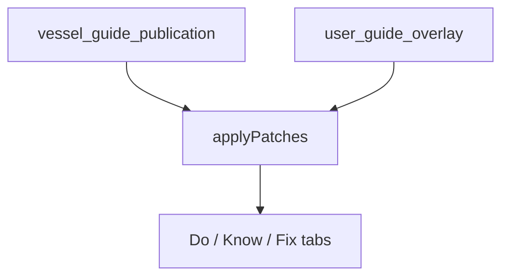

# Cursor Build Instructions: User Guide Overlays

## Objective

Allow **private owners and charter guests** to personalize vessel guide content (procedures, system sections, fix-card steps) through the **mobile app only**, with:

- **Multi-device sync** when signed in (Auth0)
- **Survival across admin republication** where the canonical base at a path is unchanged
- **Conflict resolution** when admin regen changes text the user had edited
- **Admin visibility** into edit hotspots and promotion paths into canonical content

This is **not** a fork of the vessel guide. Overlays are personal; the shared publication remains unchanged unless admin explicitly promotes an insight.

**Roadmap:** `PLATFORM_ROADMAP.md` § User guide personalization  
**Schema:** `clever-sailor-data-model.md` § `user_guide_overlay`

---

## Source of truth

- **`clever-sailor-data-model.md`** — publication contract, overlay table sketch, locked product decisions
- **`mobile/src/app/core/models/bootstrap-content.model.ts`** — bootstrap shape; extend with `key` fields
- **`PLATFORM_ROADMAP.md`** — phase ordering and deliverable checklist

---

## Non-goals (v1)

- Shared **crew overlay** visible to all users on a vessel (defer)
- Full structural edits (add/remove/reorder steps) — tier C (defer)
- Full module replacement — tier D (defer)
- Merging user overlays into `vessel_guide_publication` automatically
- Semantic / LLM-based auto-merge on conflict
- Admin editing user overlays directly (read aggregates; promote to canonical separately)
- Wiki-style free-form pages

---

## Content stack (four layers)

| Layer | Scope | Editor |
|-------|--------|--------|
| Equipment fragments + content library | Fleet / model | Admin |
| `guide_content` | Per vessel (reviewed) | Admin |
| `vessel_guide_publication` | Per vessel snapshot | Publish |
| **`user_guide_overlay`** | Per user + vessel | Mobile |



---

## Edit tiers

| Tier | Operation | Emergency / MAYDAY |
|------|-----------|-------------------|
| **A** | Annotation below a step | Notes only |
| **B** | Replace step/checklist item text | Blocked |
| **C** | Add/remove/reorder steps | Blocked (defer) |
| **D** | Replace entire module | Blocked (defer) |

UI must always distinguish **“Vessel guide”** vs **“Your note”** / **“Your edit”**.

---

## Personas

| Persona | Overlay lifespan | Sync | Affects canonical? |
|---------|------------------|------|---------------------|
| Private owner | While associated with vessel | Yes (Auth0) | Only via admin promote |
| Charter guest | Charter period; optional “keep notes” policy TBD | Yes if signed in | Never |
| Charter operator | Uses admin `guide_content` | N/A | Yes (admin path) |
| Clever Sailor team | N/A | N/A | Promote insights to fragment / vessel guide |

Charter guest personal edits must **never** appear as the official vessel guide for the next charter party.

---

## Stable paths (prerequisite)

Patches address content by **semantic path**, not fragile array indices.

### Required publication contract changes

| Content | Path prefix | Stable key |
|---------|-------------|------------|
| Fix cards | `fix/{key}/` | `fixes[].key` — **must survive publish** (today stripped in `apply_fix_card_fragments`) |
| Checklists | `checklist/{checklistId}/` | Module key exists; add `groups[].key`, `items[].key` |
| Systems | `system/{systemId}/` | `systems[].id` exists; add `sections[].key` |
| Learn checks | `system/{id}/learnChecks/{key}` | Derive slug from text or explicit key |

### Example paths

```
fix/engine_wont_start/steps/seacock_check
system/engines/section/pre_start/items/glow_plug
checklist/safety-brief/item/life_jackets
annotation/fix/engine_wont_start/steps/2
```

### Patch JSON shape

```json
{
  "path": "fix/engine_wont_start/steps/seacock_check",
  "op": "replace",
  "value": "Confirm raw water seacock OPEN — handle parallel to hull on STBD engine",
  "base_fingerprint": "sha256:…",
  "tier": "B",
  "updated_at": "2026-07-09T12:00:00Z"
}
```

Annotation (tier A):

```json
{
  "path": "annotation/fix/engine_wont_start/steps/2",
  "op": "annotate",
  "value": "Spare impeller in starboard lazarette",
  "base_fingerprint": "sha256:…",
  "tier": "A"
}
```

---

## Regen conflict resolution

When admin publishes a new `content_hash`:

1. Client downloads new base bundle.
2. For each patch, compare `hash(current_base_at_path)` to `patch.base_fingerprint`.
3. **Match** → reapply silently (survives regen).
4. **Mismatch** → queue conflict for user resolution.

### Resolution options (mobile UI)

| Action | Effect |
|--------|--------|
| **Use updated guide** | Drop patch |
| **Keep mine** | Retain user text; update fingerprint cautiously (warn on safety content) |
| **Merge manually** | Side-by-side editor for that path |
| **Keep as note** | Downgrade to tier A annotation |

No silent wrong-boat text. No semantic auto-merge.

---

## Mobile architecture

### Phase A — local only (no auth)

- `GuideOverlayStore` in IndexedDB keyed by `vesselSlug`
- `EffectiveContentService` wraps `ContentService`:
  - `getEffectiveBootstrap()` → `applyPatches(base, overlay)`
- Edit UI on Fix / checklist / system detail (tier A annotations first)
- Do **not** mutate cached publication JSON in place

### Phase B — Auth0 sync (Phase 4)

```
GET  /api/v1/users/me/overlays/{vesselSlug}
PUT  /api/v1/users/me/overlays/{vesselSlug}
```

- `user_id` = Auth0 `sub` (same pattern as `notifications.user_id`)
- `UNIQUE (user_id, vessel_id)`
- Incremental sync via `revision` + last-write-wins per path (same user, multiple devices)
- Offline: queue patches locally; push on reconnect

### Progress migration

`ProgressService` today uses `groupIndex-itemIndex` for checklist state. When checklist `key`s land, migrate progress keys to semantic paths without losing user data.

---

## Admin architecture (Phase 4)

### Overlay insights (read-only aggregates)

```
GET /api/v1/admin/vessels/{id}/overlay-insights
GET /api/v1/admin/vessels/{id}/overlay-insights/{path}
```

Surface:

- Edit count per path (“12 users changed engine start step 3”)
- Post-regen conflict rate
- Safety-path edit flags (emergency, MAYDAY attempts blocked in app but log attempts if needed)

Default: **aggregated, anonymized**. Named user only for support with consent.

### Promotion workflow

Admin actions (manual, not automatic):

1. **Promote to vessel guide** — create/edit `guide_content` draft from aggregated user text
2. **Promote to equipment fragment** — upsert `equipment_guide_fragment` for fleet reuse

Optional: during admin regen review, show “N users have personal edits on this module.”

---

## Backend tables (Phase 4 migration)

See `clever-sailor-data-model.md` for `user_guide_overlay` sketch.

Optional normalized patch log if JSONB merge becomes awkward at scale — start with JSONB `patches` array.

---

## Development guardrails

Use this checklist when touching related code **before overlay UI ships**:

### Publication & assembly

- [ ] Fix cards retain `key` through `build_fix_cards_module` → publish → mobile types
- [ ] New checklist groups/items get explicit or derived `key`
- [ ] New system sections get optional `key`
- [ ] Vessel-specific text (contacts, names) stays in assembly slots — not in user overlays at generation time

### Mobile

- [ ] Tab pages read content through a single accessor (prepare for `EffectiveContentService`)
- [ ] Cached publication bundle is immutable after download
- [ ] Personal edits never write back into the publication cache

### Admin & generation

- [ ] Vessel-wide truth changes go through `guide_content` + review + publish
- [ ] Equipment fleet truth goes through `equipment_guide_fragment`
- [ ] Emergency module remains non-overridable (tier B+)

### Auth (Phase 4)

- [ ] Vessel association model defines who may read/write overlays
- [ ] Overlay APIs require authenticated user with vessel access

---

## Phased delivery

| Phase | Deliverable | Depends on |
|-------|-------------|------------|
| **Now (2–3)** | Publication stable keys | Publish loop |
| **3A** | Local tier A annotations + `EffectiveContentService` | Stable keys |
| **4** | `user_guide_overlay` + sync API | Auth0 |
| **4** | Tier B overrides + conflict UI | Sync + regen |
| **4** | Admin overlay insights + promote workflow | Sync |

---

## Testing requirements

- Patch replay: fingerprint match after republication with unchanged path
- Conflict: admin changes step user edited → conflict surfaced, not silent merge
- Offline: edit offline, restart app, annotation persists (local phase)
- Sync: same user, two devices, eventual consistency
- Emergency path: tier B replace blocked on MAYDAY steps
- Promotion: admin promote does not delete user overlay unless user opts in

---

## Acceptance criteria

- [ ] Published fix cards include stable `key` in bootstrap JSON
- [ ] User can add a personal note on a fix step offline; persists across restarts
- [ ] Signed-in user sees same overlay on second device
- [ ] Non-conflicting user edits survive admin republish without prompt
- [ ] Conflicting edits show resolution UI
- [ ] Admin sees aggregated edit counts per path
- [ ] Emergency/MAYDAY not overridable (tier B+)

---

## Related documents

| Document | Scope |
|----------|--------|
| `PLATFORM_ROADMAP.md` | Phase ordering, economics interaction |
| `clever-sailor-data-model.md` | Schema, publication contract |
| `backend/content/README.md` | Stable keys in YAML library |
| `cursor-build-intake-flow.md` | Private owner onboarding (Phase 6) |
| `cursor-build-admin-portal.md` | Admin promote workflow extension |
