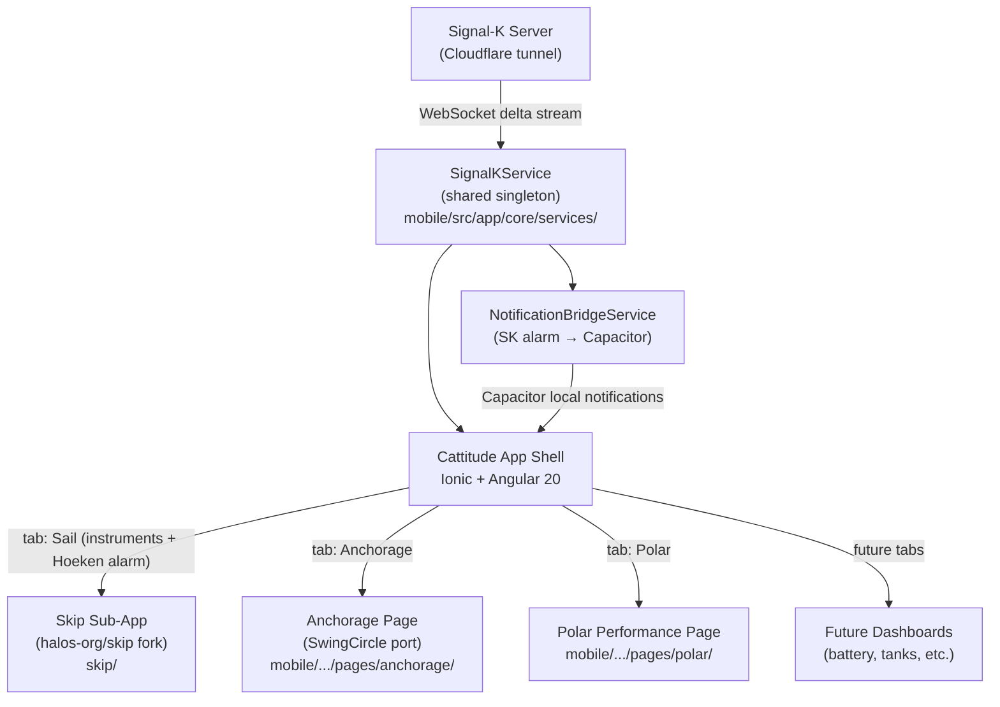

# Live Data Expansion Plan — Signal-K, Skip, Anchor & Polar

Extend the Cattitude Ionic/Angular PWA with a full live-data layer: Signal-K connection
management, a forked Skip (`halos-org/skip`) instrument panel embedded as a native tab
with shared theming, anchor safety (Hoeken's alarm + SwingCircle neighbour awareness),
polar performance display, and an extensible module framework for future dashboards
(batteries, tanks, charge rate, etc.).

This plan was produced after a full review of the existing app stack (Ionic 8 / Angular 20,
Capacitor), the Skip source, SwingCircle, and the available Signal K server plugin ecosystem.

---

## Local Signal K simulator

`signalk-sim/` is a standalone WebSocket generator (ported from SwingCircle, extended
for polar/wind). Default scenario `sailing` streams own-vessel TWA, TWS, and STW.
See `signalk-sim/README.md`. Point Settings at `http://localhost:3000`.

---

## Architecture Overview



---

## Integration Model

**Monorepo sub-application.** Skip is cloned into `skip/` (sibling of `mobile/` and
`backend/`) and registered as a separate Angular project in the workspace `angular.json`.
It lazy-loads under `/v/:slug/tabs/sail` via a thin `SkipHostComponent`.

Key design decisions:

- Both apps are Angular (Cattitude 20, Skip 21). Close enough to share a workspace with
  separate `tsconfig` targets and independent build pipelines.
- Skip's Angular Material CSS custom properties are overridden at the `sail` route level
  with Cattitude design tokens (navy/teal palette, DM Sans). No full white-labelling — 
  Material tokens map directly to Cattitude colors.
- Cattitude's bottom tab bar renders above Skip; Skip's own sidenav and top bar are hidden
  via a CSS scope rule on `SkipHostComponent`.
- Signal-K connection state lives in a **shared `SignalKService`** in Cattitude's core.
  Skip's internal `SignalKConnectionService` is replaced with a thin adapter that delegates
  to this shared service — one WebSocket, shared across all live-data features.
- Upstream Skip improvements flow in via `git fetch upstream && git merge upstream/main`
  on the `skip/` subtree. The fork tracks `halos-org/skip main`; we merge after each
  Skip release tag.

---

## Phase A — Signal-K Connection Layer

**New service**: `mobile/src/app/core/services/signal-k.service.ts`

Responsibilities:
- Store configured server URL in `localStorage` (key `cattitude.signalk.url`)
- Open WebSocket to `ws(s)://<host>/signalk/v1/stream?subscribe=all`
- Auto-promote Cloudflare `https://` URLs to `wss://`
- Expose:
  - `connected$: Observable<boolean>`
  - `delta$: Observable<SignalKDelta>` — raw delta stream consumed by all features
  - `self$: Observable<string>` — own vessel context (from SK `hello` message)
- Auto-reconnect with exponential back-off (modelled on SwingCircle's `signalk.provider.ts`)

**Settings section** (`mobile/src/app/pages/settings/`):
- Signal-K Server URL input + Test Connection button
- Live connection status badge (shown in the tab bar icon when connected)
- Documents which SK server plugins are required (Hoeken's anchor alarm)

**Tab bar**: the existing 5 tabs (Home, Do, Know, Fix, Ask) grow. To avoid crowding,
live-data pages are grouped under a "Sail" icon with a sub-menu or second-row approach.
The exact UI pattern (action sheet vs nested tabs) is resolved during Phase A/B
implementation — the options are:
  - (a) A "Live" tab that opens a quick-action sheet (Sail / Anchorage / Polar) — recommended
  - (b) Scroll the tab bar horizontally (Ionic supports this natively)
  - (c) Replace with a hamburger drawer covering all pages

---

## Phase B — Skip Fork & Monorepo Integration

### Fork setup

1. Fork `halos-org/skip` → `ilopata1/skip` on GitHub
2. Clone into `skip/` inside the Cattitude monorepo
3. Register as a project in root `angular.json` with its own build target and serve path
4. Add upstream remote for future merges

### Theme bridge

`skip/src/theme/cattitude-override.scss` — maps Skip's Angular Material tokens to Cattitude
design tokens:

| Material token | Cattitude token |
|---|---|
| `--mat-primary` | `--cattitude-teal` (#00b4c8) |
| `--mat-background` | `--cattitude-navy` (#0d2137) |
| Surface / card background | Cattitude dark-navy variants |
| Body font | DM Sans (drop Playfair Display in Skip — too decorative for instrument panels) |

This file is imported only inside `SkipHostComponent`, scoped to the `sail` route.

### Routing integration

`mobile/src/app/pages/sail/skip-host.component.ts`:
- Full-viewport host for Skip's Angular router outlet
- Hides Skip's own sidenav/header chrome
- Provides a `SignalKAdapterService` to Skip's DI — adapts Cattitude's `SignalKService`
  to Skip's expected interface (connection URL, delta stream, token)
- Intercepts/disables Ionic swipe-back gesture while inside the `sail` route (Skip uses
  its own vertical-swipe dashboard navigation that conflicts with Ionic's swipe-back)

### KipConfig seed

`skip/src/assets/default-config/cattitude-default.json` — loaded by Skip as the
factory-reset configuration when no user config exists in IndexedDB.

Sourced from the reviewed `KipConfig.json` (10 widgets on the "Supernova" dashboard):

| Widget | Signal-K path |
|---|---|
| Boat Speed | `navigation.speedThroughWater` |
| Heading | `navigation.headingTrue` |
| Log | `navigation.log` |
| SOG | `navigation.speedOverGround` |
| COG | `navigation.courseOverGroundTrue` |
| AWA | `environment.wind.angleApparent` |
| AWS | `environment.wind.speedApparent` |
| TWS | `environment.wind.speedTrue` |
| TWD | `environment.wind.directionTrue` |
| True Wind Direction (compass) | `environment.wind.directionTrue` |

A second default dashboard (Anchor Watch) is added in Phase C1.

---

## Phase C — Anchor Safety (Three-Part)

The anchor alarm problem splits cleanly into two distinct concerns:
1. **Own-boat drag detection** — server-side, rode-aware, engine-integrated (Hoeken's)
2. **Neighbour conflict awareness** — client-side AIS geometry (SwingCircle)
3. **Notification bridge** — makes both useful when off-board

### C1 — Hoeken's Anchor Alarm (primary drag alarm, via Skip)

`hoeken/hoekens-anchor-alarm` is a Signal K server plugin with a polished map-based web UI.
Skip already ships `widget-hoekens-anchor-alarm` — an iframe wrapper that embeds the plugin
UI directly into a Skip dashboard tile. No client-side alarm logic is needed.

**What Cattitude provides:**
- A second dashboard entry in the KipConfig seed: a full-screen Hoeken's anchor alarm widget
- The Settings page documents that `hoeken/hoekens-anchor-alarm` must be installed on the
  vessel's Signal K server

**Features from the plugin (free, no client work):**
- Drag-to-set anchor position on a Leaflet map
- Circle, sector, or free-form polygon alarm zones
- Engine auto-cancel — silences alarm when `propulsion.*.rpm > 0` (critically useful:
  no alarm bombardment when motoring off a drag)
- 24-hour position track history with coloured trails
- Rode-length radius calculation from depth + chain scope
- Alarm fires on SK notification stream (`notifications.navigation.anchor`)

**Remote operation:** as long as the Cloudflare SK URL is configured, the app receives
alarm notifications via the shared `SignalKService` delta stream. Phase C3 bridges to
device push.

### C2 — SwingCircle Anchorage Awareness (neighbour conflict detection, in-client)

SwingCircle solves a different problem from Hoeken's: *will my neighbour's swing circle
overlap mine as the wind shifts overnight?* This is purely client-side geometry over
AIS data — no SK server plugin required.

Port SwingCircle's core into Cattitude as a standalone "Anchorage" page:

**`mobile/src/app/pages/anchorage/`** — new page. Port and adapt:

| SwingCircle source | Cattitude adaptation |
|---|---|
| `anchor.calculator.ts` | Copy as-is — pure math (haversine, least-squares anchor point, swing-radius state machine) |
| `vessel-store.service.ts` | Consume `SignalKService.delta$` for `vessels.*` AIS paths instead of own WebSocket |
| `map.page.ts` | Leaflet map (add `leaflet` to `mobile/package.json`) |
| `settings-store.service.ts` | Merge into Cattitude's persistent settings service |
| `signalk.provider.ts` | Delete — replaced by shared `SignalKService` |
| `aisstream.provider.ts` | Delete — Signal K `vessels.*` carries AIS natively |

Own-vessel MMSI identified from the SK `hello` message `delta.self` (already in
`SignalKService`). Conflict states (green / amber / red) drive both visual indicators on
the Leaflet map and local notifications via `@capacitor/local-notifications`.

Works over the Cloudflare URL — AIS data flows through the same Signal K WebSocket stream,
so this works when anchored and monitoring from ashore.

### C3 — NotificationBridgeService

Both Hoeken's alarm (C1) and SwingCircle (C2) need to wake the phone at 2am.

**`mobile/src/app/core/services/notification-bridge.service.ts`**:
- Subscribes to `SignalKService.delta$`
- Filters for `notifications.*` paths with `state: 'alarm'` or `state: 'emergency'`
- Fires `@capacitor/local-notifications` device notification with the alarm message
- Respects a mute schedule (suppress `nominal`/`warn`, always pass `alarm`/`emergency`)
  — mirrors the `notificationConfig` block in KipConfig
- Works while the app is backgrounded on iOS/Android (Capacitor background keep-alive,
  pattern established by SwingCircle's `background.service.ts`)

---

## Phase D — Polar Performance Page ✅ DONE

**New page**: `mobile/src/app/pages/polar/`

### Polar data

`.pol` file format: tab-separated matrix of TWA (rows) × TWS (columns) → target boat speed.
Bundled asset: `mobile/src/assets/polars/outremer-55sc.pol` (12 rows × 8 columns,
TWA 50°–150°, TWS 6–28 kn). Future vessels supply their own `.pol` file referenced in
the guide manifest.

**`PolarService`** (`mobile/src/app/core/services/polar.service.ts`):
- Parses `.pol` on load (bilinear interpolation for arbitrary TWA/TWS)
- Subscribes to `SignalKService.delta$` for:
  - `navigation.speedThroughWater` (actual boat speed)
  - `environment.wind.speedTrue` (TWS)
  - `environment.wind.angleTrueWater` (TWA)
- Maintains a rolling time-series buffer (15 min at 1-second resolution)
- Exposes `polarPct$(window: 5|10|15): Observable<number>` — percentage of polar
  for each window (actual speed / interpolated target speed × 100)

### UI

D3 polar chart (add `d3` to `mobile/package.json`):
- Semi-circular polar diagram showing target speed curve(s) at the current TWS
- Live boat speed as an animated dot on the chart
- Three large numeric readouts: 5 min / 10 min / 15 min percentage of polar
- Wind angle + speed readout, stale-data dimming when Signal K drops
- **Sail-plan advice card**: looks up the owner-edited TWA×TWS matrix (see Sail Plan Editor) and shows the primary recommendation, neighbouring-cell alternatives when close to a cutover, and a performance hint when polar % is low

### Sail Plan Editor

**New page**: `mobile/src/app/pages/sail-plan/` (Settings → Open sail plan editor, also Polar → Edit plan)

Owners enter a vessel-specific crossover chart rather than relying on the Outremer 55 PDF:
- Sail inventory
- Editable TWA and TWS cutover lists (any band widths)
- Matrix cells: primary combination, comma-separated alternatives, notes, avoid
- Optional heavy-weather overlay with its own TWA bands and TWS threshold
- Seeded with the Incidence Outremer 55 chart as a template; persisted in `localStorage`

Live advice (`sail-plan-advisor.ts`) uses current TWA/TWS from Signal-K plus instantaneous polar %. Near a band edge (4° TWA or 1.5 kn TWS) neighbouring cells are surfaced as close alternatives.

---

## Phase E — Extensibility Framework

All live-data pages follow a common registration pattern so future dashboards (battery
status, charge rate, tank levels, etc.) slot in with minimal boilerplate.

**`LivePageConfig` interface** (`mobile/src/app/core/models/live-page.model.ts`):

```typescript
interface LivePageConfig {
  id: string;
  title: string;
  icon: string;          // Ionicons name
  route: string;         // relative to tabs/
  requiresSignalK: boolean;
}
```

When `requiresSignalK: true` and Signal-K is not connected, the page renders a consistent
"Connect to Signal-K" prompt (from `LiveDataSharedModule`) rather than a blank screen.

**`LiveDataSharedModule`** (`mobile/src/app/shared/live-data/`):
- `<sk-status-badge>` — connection indicator (colored dot + latency ms)
- `<sk-value path="..." unit="...">` — displays a Signal-K path value with unit
  conversion and stale-data dimming
- `<sk-page-shell>` — full-viewport wrapper with Cattitude header, consistent padding,
  and the "Connect to Signal-K" guard

**`LIVE_PAGES` registry** (`mobile/src/app/tabs/live-pages.registry.ts`):
Adding a new live-data page is a one-line entry in this registry. The tab bar and routing
are driven from it.

---

## Phase F — Settings Page

`mobile/src/app/pages/settings/` — accessible from the Home header or as a dedicated tab.

| Setting | Detail |
|---|---|
| Signal-K Server URL | Text input + Test Connection button |
| Connection status | Last connected timestamp, ping latency |
| Required SK plugins | Documents Hoeken's anchor alarm dependency |
| Notification mute levels | Which SK alarm severities trigger device notifications |
| Night mode | Toggle (delegates to Skip config when on Sail tab) |
| Polar file | Shows current polar filename; future: upload custom `.pol` |
| Sail plan | Link to sail-plan editor (TWA/TWS cutovers and sail combinations) |

---

## File / Folder Changes Summary

| Path | What |
|---|---|
| `skip/` | Forked Skip sub-app (halos-org/skip) |
| `mobile/src/app/core/services/signal-k.service.ts` | Shared Signal-K WebSocket service |
| `mobile/src/app/core/services/polar.service.ts` | Polar computation + rolling averages |
| `mobile/src/app/core/services/notification-bridge.service.ts` | SK alarm → Capacitor notifications |
| `mobile/src/app/core/models/live-page.model.ts` | `LivePageConfig` interface |
| `mobile/src/app/pages/sail/` | Skip host component + theme scope + SK adapter |
| `mobile/src/app/pages/anchorage/` | Anchorage awareness page (SwingCircle port) |
| `mobile/src/app/pages/polar/` | Polar performance page |
| `mobile/src/app/pages/settings/` | Settings page |
| `mobile/src/app/shared/live-data/` | Shared live-data components |
| `mobile/src/app/tabs/live-pages.registry.ts` | LIVE_PAGES registry |
| `mobile/src/app/tabs/tabs.page.html` | Add live-data tab entry |
| `mobile/src/app/tabs/tabs-routing.module.ts` | Add new routes |
| `mobile/src/assets/polars/outremer-55sc.pol` | Bundled polar file |
| `skip/src/assets/default-config/cattitude-default.json` | KipConfig seed (instruments + anchor) |
| `skip/src/theme/cattitude-override.scss` | Material theme bridge |

---

## Implementation Sequence

| # | Phase | Dependency | Deliverable |
|---|---|---|---|
| 1 | **A** | none | Signal-K service + Settings page skeleton |
| 2 | **B** | A | Skip fork + monorepo integration + KipConfig instruments dashboard |
| 3 | **C1** | B | Hoeken's anchor alarm dashboard (KipConfig entry only) |
| 4 | **C3** | A | NotificationBridgeService (small; delivers remote-alarm value immediately) |
| 5 | **C2** | A | SwingCircle anchorage awareness page + Leaflet map |
| 6 | **D** ✅ | A | Polar performance page (D3 chart + rolling averages) |
| 7 | **E/F** | B–D | Extensibility framework formalization + Settings page completion |

---

## Open Questions (resolve during implementation)

- **Tab bar crowding**: 5 existing + 3 new = 8 tabs. Recommended approach: group
  Sail / Anchorage / Polar under a single "Live" icon with an action sheet or popover.
  Decide at Phase A based on UX testing.
- **Skip gesture conflicts**: Skip uses vertical swipe for dashboard navigation; Ionic
  uses swipe-back for route navigation. The `SkipHostComponent` must disable Ionic's
  swipe-back gesture while inside the `sail` route.
- **Upstream Skip sync cadence**: propose merging `halos-org/skip main` after each
  Skip release tag; review the diff for conflicts with the theme bridge and SK adapter
  before merging.

---

## Relationship to Existing Roadmap

This expansion is a new workstream running in parallel with the existing Phase 2–4
platform work. It does not depend on Phase 4 auth and can proceed independently. The
Signal-K URL introduced here is the same endpoint that Phase 6 ("Signal-K equipment scan
endpoint") will eventually use for vessel onboarding automation.

See [`PLATFORM_ROADMAP.md`](PLATFORM_ROADMAP.md) for the full platform phase summary.
